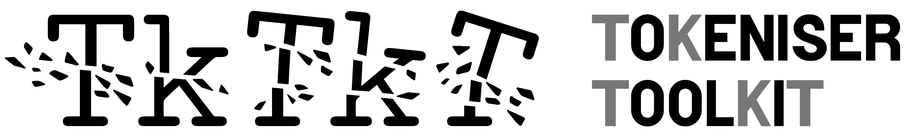

# TkTkT: the ToKeniser ToolKiT
A collection of Pythonic subword tokenisers and text preprocessing tools, with full
backwards- *and* forwards-compatibility with HuggingFace `tokenizers`. One package to rule them all.

Quick navigation:
- <a href="#installation">Installation</a>
- <a href="#features">Features</a>
- <a href="#examples">Examples</a>
- <a href="#architecture">Architecture</a>

## Features
### Supported tokenisers
All subword tokenisers are defined under `tktkt.models`. Many of these can be instantiated without much background knowledge using the builders in `tktkt.factories`.
Also, **any HuggingFace tokeniser** can be wrapped into a TkTkT tokeniser, and **any TkTkT tokeniser** can be wrapped into a HuggingFace tokeniser.

Currently, the package implements:
- Byte-pair encoding (BPE) tokenisers:
  - Classical **BPE** ([Sennrich et al., 2016](https://aclanthology.org/P16-1162/)), with added support for *n*-ary merges (byte-tuple encoding, BTE) and any word boundary marker (start-of-words like GPT-2 and end-of-words like Sennrich).
  - **BPE-dropout** ([Provilkov et al., 2020](https://aclanthology.org/2020.acl-main.170/))
  - **BPE-knockout** ([Bauwens & Delobelle, 2024](https://aclanthology.org/2024.naacl-long.324/))
  - **TrimmedBPE** ([Cognetta et al., 2024](https://arxiv.org/abs/2404.00397))
  - Other variants:
    - **EnsuredBPE**: BPE where the last merges have been replaced by the merges necessary to ensure that a given list of strings is in the vocabulary.
    - **ShuffledBPE**: BPE but with merge priorities shuffled, although types are never shuffled to a priority before the ancestors in their merge tree.
- **Unigram language model (ULM)**, dubbed *KudoPiece* in TkTkT ([Kudo, 2018](https://aclanthology.org/P18-1007/)):
  - Wrapper around the [SentencePiece](https://github.com/google/sentencepiece) package
  - Native implementation in TkTkT
- **Greedy** tokenisers ([Bauwens, 2023](https://bauwenst.github.io/cdn/doc/pdf/2023/masterthesis.pdf) and later [Uzan et al., 2024](https://arxiv.org/abs/2403.01289)):
  - Left-to-right and right-to-left
  - Random-access, dubbed "FLOTA" by [Hofmann et al., 2022](https://aclanthology.org/2022.acl-short.43/).
- **Derivative leverager (DeL)** ([Hofmann et al., 2021](https://aclanthology.org/2021.acl-long.279/)).
  - Segmentation
  - Trainer
- Character/byte **N-grams**.
- **SaGe** ([Yehezkel & Pinter, 2023](https://aclanthology.org/2023.eacl-main.45/)) vocabularisation.
- **Randomised** segmentation from a given subword vocabulary.

Currently work in progress:
- A family of Viterbi-driven tokenisers.
- Morfessor family

TkTkT also has classes to alternate between tokenisers across pretokens.

### Preprocessing
TkTkT has a rich set of text mappings and pretokenisers that preprocess text before it is tokenised, including
support for stochastic perturbation. Unlike other libraries, preprocessors are objects, not regular expressions.
This allows much more powerful processing than regex, whilst being more easy to read. See if you can understand 
this arguably complicated transformation:
```python
from tktkt.preparation.splitters import *
from tktkt.preparation.mappers import PseudoByteMapping
from tktkt.factories.preprocessing import RobertaSpaceMarker

class ExamplePretokeniser(PretokeniserSequence):
    def __init__(self):
        super().__init__([
            PunctuationPretokeniser(HyphenMode.EXCLUDED, protect_apostrophes_without_spaces=True),
            WhitespacePretokeniser(destructive=True),
            EnglishApostrophes(do_nt=True),
            
            MapperAsPretokeniser(PseudoByteMapping()),
            AddWordBoundary(RobertaSpaceMarker),
            
            IsolateDigits(),
            PunctuationPretokeniser(HyphenMode.ONLY)
        ])
```

### Evaluation metrics
TkTkT currently supports the following intrinsic tokeniser evaluation metrics:
- *Fertility* statistics: how many tokens the tokeniser produces per word, and how many segmentations its vocabulary could produce in theory.
- *Morphological* boundary recognition: using the tokeniser as a binary classifier for whether two morphemes meet at each
  position in a word.
- Entropy-based measures, including *Rényi efficiency*.
- Richness of token contexts with *accessor variety*.
- *Comparison* between two tokenisers: how much they tokenise words exactly the same, and how much their split points overlap.

### Visualisers
The following tokenisation procedures can be visualised:
- BPE/BTE: the final merge tree (in regular LaTeX), as well as an animated progression of the merges (in LaTeX Beamer).

## Architecture
### Main interfaces
The goal of TkTkT is to provide a straightforward Pythonic interface for everything-tokenisation, and to be as 
object-oriented as possible. The main interfaces are found under `tktkt.interfaces`. 

#### Segmentation
Fundamentally, all tokenisers are a `Tokeniser` that have a `Preprocessor`.

- The `Tokeniser` class has two important methods: 
  - `.tokenise(pretoken: str) -> List[str]`: segments a string as-is into parts.
  - `.prepareAndTokenise(text: str) -> List[str]`: applies the tokeniser's preprocessor and then tokenises each pre-token separately.

- The `Preprocessor` class is a pipeline of three components: 
  1. a non-invertible text mapping
  2. an invertible text mapping
  3. a pretokeniser that splits strings into smaller strings.

To map tokens (string segments) to identifiers (integers) for indexing into an embedding matrix, three interfaces are
supported:
- `TokeniserWithFiniteIdRange`: tokenisers with a finite range of IDs, but an infinite domain of tokens that map into that range.
  An example is a hashing vocabulary.
- `TokeniserWithFiniteTypeDomain`: same as above, but only supports mapping a predetermined set of unique tokens (types).
  No assumption is made about how this mapping happens. HuggingFace's `PreTrainedTokenizer` is an example of these.
- `TokeniserWithVocabDict`: same as above, but the mapping is made by an explicit dictionary.

For ease-of-use, many `Tokeniser` classes have a `TokeniserFactory` defined for them that simplify the instantiation process.

#### Vocabularisation
To learn the parameters of a `Tokeniser` (e.g. BPE merges), there is the `Vocabulariser` class.
It can learn from word-count files or from corpora of sentences. It takes a `Preprocessor` exactly like `Tokeniser`,
except `Vocabulariser` is for training the tokeniser (vocabularisation) and `Tokeniser` is for inference (segmentation).

To make it easier to load the results of a vocabularisation run from storage back into Python, there are `Deserialiser`s
to do this for you. Often, a `TokeniserFactory` will take a `Deserialiser` to provide it any files.

### Submodules
The packages is divided into the following submodules:
- `tktkt.interfaces`: contains the main parent classes from which all other classes derive. 
  - The most important classes are `TextMapper`, `Pretokeniser`, `Preprocessor`, `Vocabulariser`, `Tokeniser`, `Deserialiser`, and `TokeniserFactory`.
- `tktkt.preparation`: contains all the text preprocessing tools.
- `tktkt.models`: contains all the tokenisation (i.e. vocabularisation and/or segmentation) algorithms.
- `tktkt.wrappers`: contains classes that wrap around existing tokenisers to equip them with more features.
  - `tktkt.wrappers.multiplexing`: alternate between multiple tokenisers within the same sentence.
  - `tktkt.wrappers.hashingvocab`: add a string-to-integer mapping to a `Tokeniser` that can produce any substring, turning it into a `TokeniserWithFiniteIdRange`.
- `tktkt.factories`: contains a bunch of pre-defined constructor calls, for both vocabularies and tokenisers:
  - `tktkt.factories.deserialisation`: contains classes that load the files for specific tokenisers.
  - `tktkt.factories.tokenisers`: contains tokeniser factories.
  - `tktkt.factories.preprocessing`: contains a bunch of pre-defined preprocessors so you don't have to.
    Check out the `ModernEnglishPreprocessor`, for example.
- `tktkt.evaluation`: contains procedures to quantify a `Tokeniser` with through inference.
- `tktkt.visualisation`: contains procedures to generate explanatory LaTeX code about some models.
- `tktkt.util`: contains tools peripheral to tokenisation, like string formatting, combinatoric calculations, iterable functions, timing, etc...

## Installation
### Non-editable (recommended)
Simply run
```shell
pip install "tktkt[github] @ git+https://github.com/bauwenst/TkTkT"
```
where you should leave out the `[github]` suffix if you have an editable installation of [`bpe_knockout`](https://github.com/bauwenst/BPE-knockout).

### Editable
If you want to keep TkTkT out of your `site-packages` for easy editing, an editable install is always possible:
```shell
git clone https://github.com/bauwenst/TkTkT
cd TkTkT
pip install -e .[github]
```
where the same caveat applies about the `[github]` suffix.

## Examples
### Basic usage
Let's first instantiate a toy preprocessor in TkTkT:
```python
from tktkt.factories.preprocessing import Preprocessor, KudoSpaceMarker, \
    Lowercaser, Replace, \
    PretokeniserSequence, WhitespacePretokeniser, PunctuationPretokeniser, AddWordBoundary

toy_preprocessor = Preprocessor(
    Lowercaser(),
    Replace("!", "."),
    PretokeniserSequence([
        WhitespacePretokeniser(),
        PunctuationPretokeniser(),
        AddWordBoundary(KudoSpaceMarker)
    ])
)

print(toy_preprocessor.do("This example will be preprocessed (even without a tokeniser)!"))
```
Now we instantiate a greedy TkTkT tokeniser with that preprocessor:
```python
from tktkt.models.greedy.directional import L2R_Greedy

tokeniser = L2R_Greedy(
    preprocessor=toy_preprocessor,
    vocab={"a": 0, "b": 1, "c": 2, "d": 3, "ab": 4, "ba": 5, ".": 6, ",": 7, "▁": 8}
)

print(tokeniser.prepareAndTokenise("A bad cab, ABBA!"))
print(tokeniser.tokenise("abc."))
```
There are many more preprocessing classes available, some pre-made. Check out the `ModernEnglishPreprocessor` 
for typical modern use-cases.

### HuggingFace compatibility
In the example below, a BPE tokeniser is loaded from the HuggingFace hub as a `PreTrainedTokenizerFast` and converted into a TkTkT `Tokeniser` object.
Then, this object is itself converted into a HuggingFace `PreTrainedTokenizer` again.
```python
# Backwards-compatibility:
from transformers import AutoTokenizer
from tktkt.models.huggingface.wrapper import HuggingFaceTokeniser

hf_roberta = AutoTokenizer.from_pretrained("roberta-base")
tktkt_roberta = HuggingFaceTokeniser(hf_roberta)

###
sentence = " That's so supercalifragilisticexpialidocious, Günther!"
print("Full tokenisation pipeline:")
print("\tHF Tk:", hf_roberta.tokenize(sentence))  # Note the lack of autocompletion on this.
print("\tTkTkT:", tktkt_roberta.prepareAndTokenise(sentence))
print("Only the preprocessing:")
print("\tTkTkT:", tktkt_roberta.preprocessor.do(sentence))
###

# Forwards-compatibility:
from tktkt.interfaces.huggingface import TktktToHuggingFace

hf_tktkt_roberta = TktktToHuggingFace(tktkt_roberta, specials_from=hf_roberta)
print(hf_tktkt_roberta.tokenize(sentence))
```

### Training and instantiating BPE
Here's a minimal working example to train a BPE tokeniser on the first 10 000 examples of the English part of C4.
```python
from datasets import load_dataset
corpus = load_dataset("allenai/c4", "en", streaming=True)["train"].take(10_000)

from tktkt.factories.preprocessing import ModernEnglishPreprocessor_SentencePieceCompatible, RobertaSpaceMarker
from tktkt.models.bpe.vocabularisation import BPEVocabulariser, BpeTrainerImplementation

marker = RobertaSpaceMarker
preprocessor = ModernEnglishPreprocessor_SentencePieceCompatible(marker_location=marker.location)

vocabulariser = BPEVocabulariser(
    preprocessor=preprocessor, 
    implementation=BpeTrainerImplementation.SENTENCEPIECE,
    vocab_size=32_768,
    replace_boundary_marker_with=marker
)
bpe_folder = vocabulariser.vocabulariseFromHf(corpus, text_field="text")
```
and to load the result into a HuggingFace-accelerated tokeniser, we can call
```python
from tktkt.factories.preprocessing import ModernEnglishPreprocessor
from tktkt.models.huggingface.bpe import HuggingFaceBPETokeniser

tokeniser = HuggingFaceBPETokeniser(
    preprocessor=ModernEnglishPreprocessor(marker),
    vocab=vocabulariser.load(bpe_folder), 
    merges=vocabulariser.loadMerges(bpe_folder)
)
```
or, if we have made the results available in a `Deserialiser`, we can use a `TokeniserFactory` to do this for us in a one-liner.
I once trained BPE across the first 3 million examples in SlimPajama, and thus we can run:
```python
from tktkt.factories.deserialisation import BPE32ki_SlimPajama3M
from tktkt.factories.tokenisers import Factory_BPE

tokeniser = Factory_BPE(files=BPE32ki_SlimPajama3M()).buildTokeniser()
```
Note that the preprocessor comes with the deserialiser, so the factory doesn't require that you specify it.

### Training and instantiating ULM (a.k.a. KudoPiece)
Let's now say you want to train and load an English ULM tokeniser. You are, of course, scared of the `sentencepiece` library
because its Python interface is a thin wrapper around a command-line call, not allowing autocompletion in your IDE.
In TkTkT, you would proceed as follows (note that ULM is called "KudoPiece" in TkTkT because many tokenisers are based on a language model of unigrams).

First we instantiate a preprocessor, and call the trainer with relevant training arguments:
```python
from tktkt.factories.preprocessing import ModernEnglishPreprocessor_SentencePieceCompatible, BoundaryMarkerLocation
from tktkt.models.kudopiece.vocabularisation import *

### Your data iterator goes here.
sentence_corpus: Iterable[str] = ...
###

preprocessor = ModernEnglishPreprocessor_SentencePieceCompatible(
    marker_location=BoundaryMarkerLocation.START
)

trainer = KudoPieceVocabulariser(
    preprocessor=preprocessor,
    final_vocab_size=40_000,
    arguments=KudoPieceArguments(character_coverage=0.9995),
    file_stem="tutorial"
)
model_path = trainer.vocabulariseFromStringIterable(sentence_corpus)
```
Once the final model is stored to disk, we can load it as an object (and give it a basic preprocessor).
Note that all models are stored under `tktkt.files.paths.DataPaths.pathToModels()`.
```python
from tktkt.models.kudopiece.segmentation import KudoPieceTokeniser

# # If you need to recover the path:
# from tktkt.files.paths import TkTkTPaths
# model_path = TkTkTPaths.pathToModels() / "kudopiece" / "tutorial_xxxx-yy-zz_aa-bb-cc.model"

tokeniser = KudoPieceTokeniser(preprocessor=preprocessor, model_file=model_path)

print(tokeniser.prepareAndTokenise("Hello there, my good friend!"))
```

## Why does this package exist if we have HuggingFace `tokenizers`?
First of all, note again that TkTkT has backwards compatibility with HuggingFace `tokenizers`. 
There are wrapper classes for tokenisers under `tktkt.models.huggingface` and for normalisers/pretokenisers under
`tktkt.preparation.huggingface`.

Here's a non-exhaustive list of reasons:
1. The HuggingFace `tokenizers` library has horrifically un(der)documented Python interfaces. Some classes even accept 
  arguments that aren't in their signature. 
2. The `tokenizers` library is implemented in Rust and hence there is no possibility of inspecting implementations in any Python IDE. Have fun using your black box.
3. The `tokenizers` interface does not allow separating preprocessing from the actual tokenisation algorithm.
   - The `PreTrainedTokenizerBase` class, from which the "slow" (Pythonic) `PreTrainedTokenizer` and "fast" (Rustic) 
      `PreTrainedTokenizerFast` classes both inherit, only declares an end-to-end `.tokenize()` method (equivalent to TkTkT's
      `.prepareAndTokenise()`). The interface for these subclasses is different enough that both lack features of the other: 
      - Whereas `PreTrainedTokenizer` does declare a `._tokenize()` (equivalent to TkTkT's `.tokenise()`), I challenge you
        to find the equivalent for `PreTrainedTokenizerFast`. Best you'll find is `.backend_tokenizer.model.tokenize()`, 
        which outputs unusable objects of class `tokenizers.Token`.
      - Whereas `PreTrainedTokenizerFast` has fields `.backend_tokenizer.pre_tokenizer` and `.backend_tokenizer.normalizer`
        (untyped of course, so you can't get autocompletion on their methods unless you manually assign them to a variable
        and annotate it yourself), `PreTrainedTokenizer` has [no access to a pretokeniser](https://github.com/huggingface/transformers/issues/26254).
        Preprocessing has to be defined inside `._tokenize()`, which means you're doing two steps of preprocessing (one inside `.tokenize()`
        and one inside `._tokenize()`) making this `._tokenize()` no longer equivalent to TkTkT's `.tokenise()`.
      - For `PreTrainedTokenizerFast`, the `.backend_tokenizer.pre_tokenizer` and `.backend_tokenizer.normalizer` fields 
        can both be `None`, rather than an identity transform like in TkTkT, meaning you always have to check if they exist. 
        Also funny: even when they are not `None`, you can't check if they exist with a simple `if t.backend_tokenizer.normalizer: ...`
        because somehow that's always `False`.
   - Also, the `PreTrainedTokenizerBase` interface is not defined with `@abstractmethod` but with an ever-increasing 
      amount of `raise NotImplementedError` methods. In other words: it's hard to know which methods need to be implemented
      and there's no enforcement mechanism to ensure everything has been implemented.
4. The `tokenizers.pre_tokenizers` submodule has technical debt that can't be patched. Some examples:
      - The mapping from Unicode codepoints to UTF-8 bytes, as first used in GPT-2, is only implemented in the `ByteLevel` 
        pretokeniser. Yet, it is concerned with more than this, since it splits on spaces and punctuation (optionally prefixed 
        by a space) before applying the mapping. This is wrong for at least three reasons: 
        - Users of the byte mapping don't necessary want the string to be split;
        - It synonymises prefixed spaces (converted to `Ġ`) with start-of-word boundaries 
          whilst actually all words (even those directly preceded by punctuation) should be marked with such a boundary; 
        - It assumes that such boundaries should always be at the start of a word.
      - The GPT-2 convention of having a word boundary at the *start* of (almost) all words is hardcoded throughout
        `transformers` and `tokenizers` (with options that commonly look like `add_prefix_space`) even though the original
        BPE paper used word boundaries at the *end* of words (`</w>`). Only supporting the start-of-word convention is bad 
        because this deteriorates downstream performance for e.g. Germanic languages, where a compound has its head at the
        end and hence it should be allowed to tokenise the head with the exact same tokens as it would be if it was isolated.
      - There is literally a normaliser class called `Precompiled` which is just one big object stored in base64 in the tokeniser config JSON. No access
        to it in Python, no interface, no description of what it does. A black box. Probably a holdover from adapting the
        `sentencepiece` package to HuggingFace, yet TkTkT doesn't do it that way.
5. Did you know that their RoBERTa BPE implementation [removes the highest-priority merge from the tokeniser](https://github.com/huggingface/transformers/blob/9b5a6450d481b0f02834684ffd8b3ba4cbbd6fe0/src/transformers/models/roberta/tokenization_roberta.py#L194)
    unless the merge file is preceded by a `#version` tag? This doesn't conform to [the BPE standard](https://github.com/rsennrich/subword-nmt/), and almost cost me a paper.
6. In the little documentation that does exist (e.g. for WordPiece and KudoPiece), there are so many 
    theoretical inaccuracies that we shouldn't even have confidence in anything that isn't a BPE tokeniser implemented by them. 
    Their [explanation for KudoPiece](https://huggingface.co/learn/nlp-course/chapter6/7), an algorithm which itself was 
    already poorly explained originally, is mathematically absurd.
7. They offer very few core models (basically only BPE and KudoPiece, which [`sentencepiece`](github.com/google/sentencepiece) already offers
    and keeps much more updated)
    whilst there exist many more in the literature, and the likelihood that someone who knows the literature comes along to
    implement all of them in C++ is rather low.

There is also the [pyonmttok](https://github.com/OpenNMT/Tokenizer) package which has better design, but also sticks to
BPE and KudoPiece.

## Pronunciation
The acronym stands for ToKeniser ToolKiT and is supposed to be pronounced fast, like a beatboxer mimicking hi-hats
(kind of like "tuh-kuh-tuh-kuh-ts" but as fast as you can). It is mandatory that you do this, because I said so.
If you are Brazilian, you may pronounce it "tuca tuca" while playing [the official TkTkT theme song](https://open.spotify.com/track/2aX7w5bdbES8A9H5FDydSA),
which gives you a peek into my demented taste in music.

If you think all of this is cringe, too bad -- it is the only way not to fall into clinical depression after realising
just how messy modern subword tokenisation is at the algorithmic *and* an implementational level.
